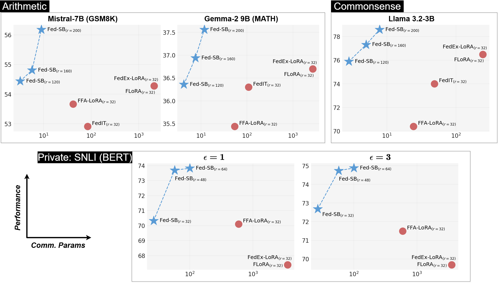

# Fed-SB: A Silver Bullet for Extreme Communication Efficiency and Performance in (Private) Federated LoRA Fine-Tuning

## Introduction

Low-Rank Adaptation (LoRA) has become ubiquitous for efficiently fine-tuning foundation models. However, federated fine-tuning of LoRA remains challenging due to non-optimal updates arising from traditional federated averaging of individual adapters. Existing solutions either incur prohibitively high communication cost that scales linearly with the number of clients or suffer from performance degradation due to limited expressivity. We introduce **Federated Silver Bullet (Fed-SB)**, a novel approach for federated fine-tuning of LLMs using LoRA-SB, a recently proposed low-rank adaptation method. LoRA-SB learns a rxr matrix between B and A, while keeping other components fixed. Direct averaging of R guarantees exact updates, substantially reducing communication cost, which remains independent of the number of clients, and enables scalability. Fed-SB achieves state-of-the-art performance across commonsense reasoning, arithmetic reasoning, and language inference tasks while reducing communication costs by up to **230x**. In private settings, Fed-SB further improves performance by (1) reducing trainable parameters, thereby lowering the noise required for differential privacy, and (2) avoiding noise amplification introduced by other methods. Overall, Fed-SB establishes a new Pareto frontier in performance vs. communication cost, offering an efficient and scalable solution for both private and non-private federated fine-tuning.



## Environment Setup

First, create and activate a virtual environment with Python 3.10, then install the necessary libraries.

ERROR: Could not find a version that satisfies the requirement pyairports==2.1.1 (from versions: 0.0.1)
ERROR: No matching distribution found for pyairports==2.1.1

**Installing Python 3.10 (if not already installed):**

```bash
# Add deadsnakes PPA for older Python versions
sudo apt update
sudo apt install software-properties-common -y
sudo add-apt-repository ppa:deadsnakes/ppa -y
sudo apt update

# Install Python 3.10
sudo apt install python3.10 python3.10-venv python3.10-dev -y
```

**Using Conda:**

```bash
conda create -n fed-sb python=3.10
conda activate fed-sb
pip install -r requirements.txt
pip install -e .
cd fed_sb
```

**Using venv:**

```bash
python3.10 -m venv .venv
source .venv/bin/activate
pip install -r requirements.txt
pip install -e .
cd fed_sb
```

*Note: Make sure Python 3.10 is installed on your system before using venv.*

### Hugging Face Authentication

Many models used in this project (e.g., Gemma, Llama) are gated and require authentication:

1. **Create a Hugging Face account** (if you don't have one):  
   Visit [https://huggingface.co/join](https://huggingface.co/join)

2. **Request access to gated models**:
   - For Gemma models: [https://huggingface.co/google/gemma-2-9b](https://huggingface.co/google/gemma-2-9b)
   - For Llama models: [https://huggingface.co/meta-llama](https://huggingface.co/meta-llama)
   - Click "Request Access" and wait for approval (usually instant)

3. **Generate an access token**:
   - Go to [https://huggingface.co/settings/tokens](https://huggingface.co/settings/tokens)
   - Click "New token" and create a token with "Read" permissions
   - Copy the token

4. **Login with your token**:
   ```bash
   huggingface-cli login
   ```
   Paste your token when prompted, or set it as an environment variable:
   ```bash
   export HF_TOKEN="your_token_here"
   huggingface-cli login --token $HF_TOKEN
   ```

## Arithmetic Reasoning

To fine-tune a model on the MetaMathQA dataset and evaluate its performance on GSM8K and MATH benchmarks, execute the following script:


```bash
bash fed/scripts/arithmetic.sh
```

You can modify the `BASE_MODEL` parameter within the script to experiment with different models.

## Commonsense Reasoning

### Dataset Preparation

1. **Fine-tuning Data:**  
   Download the fine-tuning dataset from [this link](https://github.com/AGI-Edgerunners/LLM-Adapters/blob/main/ft-training_set/commonsense_170k.json) and place it in the `data/commonsense` directory.

2. **Evaluation Data:**  
   Download the evaluation datasets from [this repository](https://github.com/AGI-Edgerunners/LLM-Adapters/tree/main/dataset). Save each dataset in its corresponding subdirectory under `data/commonsense`.

### Running the Experiments

Once the datasets are in place, run the experiments with:

```bash
bash fed/scripts/cr.sh
```

This script fine-tunes a model on the Commonsense170K dataset and evaluates it across eight different datasets. The `BASE_MODEL` parameter is configurable, allowing you to test various models.

## Privacy-Preserving Fine-Tuning

### Dataset Preparation

Download and set up the SNLI dataset automatically:

```bash
bash DP/SNLI/scripts/download_snli.sh
```

Alternatively, download manually from [this link](https://nlp.stanford.edu/projects/snli/snli_1.0.zip), unzip it, and store the contents in the `DP/SNLI/data` directory.

### Running the Experiments

There are two scenarios for privacy-preserving fine-tuning:

- **Centralized Private Fine-Tuning:**  
  Run the following script:

  ```bash
  bash DP/SNLI/scripts/central_private.sh
  ```

- **Federated Private Fine-Tuning:**  
  Run the following script:

  ```bash
  bash DP/SNLI/scripts/fed_private.sh
  ```

In both cases, you can adjust the `epsilon` parameter as needed to tune the level of privacy.

---

## Citation

If you use our work, please cite us:

```
@article{singhal2025fed,
  title={Fed-SB: A silver bullet for extreme communication efficiency and performance in (private) federated lora fine-tuning},
  author={Singhal, Raghav and Ponkshe, Kaustubh and Vartak, Rohit and Varshney, Lav R and Vepakomma, Praneeth},
  journal={arXiv preprint arXiv:2502.15436},
  year={2025}
}

@article{ponkshe2024initialization,
  title={Initialization using update approximation is a silver bullet for extremely efficient low-rank fine-tuning},
  author={Ponkshe, Kaustubh and Singhal, Raghav and Gorbunov, Eduard and Tumanov, Alexey and Horvath, Samuel and Vepakomma, Praneeth},
  journal={arXiv preprint arXiv:2411.19557},
  year={2024}
}

@article{singhal2024fedex,
  title={Fedex-lora: Exact aggregation for federated and efficient fine-tuning of foundation models},
  author={Singhal, Raghav and Ponkshe, Kaustubh and Vepakomma, Praneeth},
  journal={arXiv preprint arXiv:2410.09432},
  year={2024}
}
```
